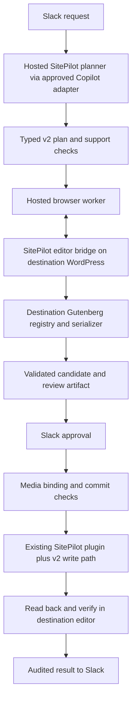

# v2 build

**SitePilot Gutenberg content engine — development specification**

**Status:** Core v2 implementation complete and locally verified; production rollout remains gated.

**Date:** 22 September 2026.

This specification defines the Gutenberg content workstream for the proposed hosted SitePilot product discussed in [Clarify LLM and Slack architecture](codex://threads/01a0b41b-1683-71d3-b496-ed4ce913e8a2). It is an additive v2 build alongside the current implementation. Existing planning, media, permissions, approval, execution and audit capabilities provide the starting point.

Implementation details and current verification commands are recorded in [Gutenberg v2 implementation](./v2-implementation.md).

The wider proposal is a fully hosted service for **one WordPress website**, with Slack as the user interface and GitHub Copilot as the organisation-approved LLM gateway. This document specifies the content engine and its integration contracts. The complete Slack application, Copilot commercial/authentication setup and hosted deployment remain separate workstreams.

## 1. Intended outcome

SitePilot must create and update supported Gutenberg content that remains editable after WordPress saves it and the editor reopens it. A job is successful only when the persisted content passes structural, editor-validity and content-preservation checks.

The LLM proposes content, layout and typed actions. The destination site's Gutenberg JavaScript implements block creation and serialization. SitePilot controls the supported operations, approvals, writes and verification.

Success means:

- No unexpected invalid-block warnings, missing-block substitutions or Classic/freeform fallbacks for accepted jobs.
- Requested text, links, images, captions and layout intent survive compilation and saving.
- Unsupported cases receive a specific failure before the target content is changed.
- A WordPress or plugin update that changes compatibility is detected before an old approved candidate is applied.
- Operation is unattended on the hosted backend; an operator's Mac or open browser tab is unnecessary.

## 2. Product and technology decisions

| Area                    | v2 decision                                                                                                                                                     |
| ----------------------- | --------------------------------------------------------------------------------------------------------------------------------------------------------------- |
| Production block engine | Gutenberg's official JavaScript APIs, using the destination site's actual registered block implementations.                                                     |
| Production integration  | A focused editor bridge in the existing SitePilot WordPress plugin, driven by a hosted browser worker.                                                          |
| Studio MCP              | Comparison and diagnosis tooling during development, on disposable sites matching the destination. It is not a production dependency or deployment requirement. |
| WPPilot                 | Reference for staged changes, editor-session readiness and finalization. Do not install it as a SitePilot dependency or copy its architecture wholesale.        |
| Block support           | Explicit reviewed support matrix intersected with the destination's available blocks and capabilities. Discovery alone does not authorise a block.              |
| Existing implementation | Keep v1 available for explicitly selected v1 jobs while v2 is introduced behind a feature flag. No silent fallback from a failed v2 job.                        |
| Hosting                 | One configured website per deployment; shared services and the worker must not depend on Electron.                                                              |
| AI provider             | Provider-neutral content contract; the hosted product uses the approved Copilot adapter. Compilation and validation make no LLM calls.                          |

Gutenberg's public APIs are documented building blocks. The new work is the adapter, editor lifecycle, validation and controlled commit protocol. If developers later propose copying upstream implementation code, record its origin, attribution and licence compatibility as a separate dependency decision.

## 3. Implemented additive integration

The implementation is isolated in these v2 paths and is the default content engine (a site can opt out with `SITEPILOT_V2_ENABLED` set to `false`):

| Location                                                                                               | Implemented v2 responsibility                                                                                                                              |
| ------------------------------------------------------------------------------------------------------ | ---------------------------------------------------------------------------------------------------------------------------------------------------------- |
| `packages/contracts/src/gutenberg-v2.ts`                                                               | Strict plans, capabilities, candidates, approvals, media, session, commit, read-back, recovery and validation wire contracts.                              |
| `packages/services/src/gutenberg-v2-*.ts`                                                              | Provider-neutral plan construction, approval-bound orchestration, durable execution state, media staging/binding and recovery.                             |
| `packages/gutenberg-worker`                                                                            | Isolated Playwright jobs, signed WordPress transport, native compile/verify/preview calls and private review artifacts.                                    |
| `plugins/wordpress-sitepilot/includes/V2`, `includes/Rest/V2_Routes.php`, `assets/js/editor-bridge.js` | Scoped native editor sessions, runtime discovery, Gutenberg compilation, durable media binding, transactional commit, read-back and conditional recovery.  |
| `tests/e2e/v2-gutenberg.ts`                                                                            | Destination-native block/media coverage, authenticated read-only enforcement, save/reopen, stale-source conflict, reconciliation and conditional rollback. |

The current PHP `serialize_blocks()` call assembles supplied parsed-block markup. It does not execute static blocks' JavaScript save implementations. Existing checks and canonicalizers remain useful v1 behaviour, but are not the v2 correctness boundary. See [Reliable Gutenberg Block Generation](./reliable-gutenberg-blocks.md) and [Custom Block Support](./custom-block-support.md).

## 4. Initial scope

The first production increment covers:

1. Creating a draft post or page from a v2 block plan.
2. Explicitly approved whole-content replacement for a resolved post/page.
3. Scoped insertions and edits on an existing block tree, using an unambiguous target tied to a source revision.
4. Existing image selection/upload/localization integrated with the new compiler.
5. Structured validation reports, review artifacts, approval binding, idempotent execution and post-write verification.

Start the compiler with paragraphs, headings, groups, columns/column, images, lists/list-item, buttons/button, quotes and spacers. Add the remaining currently supported core types through the same acceptance process, including table, pullquote and media-text. Record the exact enabled set per release; do not advertise complete parity before it passes.

Dynamic blocks and `acf/container` remain fixture-gated. The current MAMP profile does not register `acf/container`, so it provides no authoring evidence for that block. Additional third-party blocks require demonstrated schema, editor-context and render compatibility.

Initial exclusions: arbitrary plugin installation, theme/template editing, changing synced-pattern definitions, changing bound attributes, editing locked structures, automatic repair of unrelated existing invalid content, and unrestricted model-authored HTML. Existing permitted content may be preserved under the rules below. These exclusions do not remove capabilities from v1.

## 5. Runtime architecture



### Hosted browser worker

- Run a supported headless Chromium/Playwright worker beside the backend, with bounded jobs and isolated authenticated browser contexts.
- Load a SitePilot bridge in the real destination editor bootstrap. Match post type, editing user, relevant theme/plugin scripts, block supports and editor settings. A page that merely loads `wp.blocks` and core blocks is insufficient for plugin compatibility.
- Load the destination's `wp.blocks` and related packages through WordPress dependencies. An independently bundled latest `@wordpress/block-library` is not authoritative for another site's version.
- Wait for bridge readiness, required script registration and the expected capability fingerprint. A DOM body or admin shell being present is insufficient.
- Keep preflight work in memory or private staging. Do not populate a real editable post in a way that lets normal autosave modify it before approval. When a native fixture creates a draft or media, record the exact IDs and cleanup outcome; retain them for inspection when the transport has no execution-owned delete operation.
- Recover from worker restarts, expired sessions and browser crashes using durable backend job state. An unavailable runtime returns a retryable failure; it never permits unverified writes.

### WordPress authentication

The initial feasibility gate must prove unattended editor access in the client's actual authentication environment. REST Application Password access does not itself establish a browser login session.

The preferred implementation is a plugin-issued, short-lived, single-use bootstrap for a narrowly scoped service identity, obtained through the existing authenticated SitePilot connection. Bind it to the configured site, execution, requested editor context and expiry. Use an HttpOnly session cookie; redact bootstrap values and keep them out of Slack, prompts and logs. If this cannot work with the client's SSO/WAF policy, stop the implementation gate and record the approved alternative before proceeding.

The bootstrap is not itself a restriction on the resulting native WordPress session. Require a least-privilege service identity, a short session lifetime and revocation, and server-enforced site/execution/editor-context boundaries. During preparation, the worker session must not be able to mutate posts through ordinary autosave, REST or admin routes; writes occur only through the separately authorised prepared-commit operation. Prove this restriction in the authentication gate rather than relying on worker instructions.

The browser identity and API write identity must have compatible read/edit context and sanitization behaviour, even where their write permissions differ. Existing server-side capability, permission and approval checks continue to apply. Session possession must not grant approval or expand the typed bridge operations. The bridge must not expose an arbitrary JavaScript/PHP execution endpoint.

## 6. Versioned contracts

Define schemas in `packages/contracts` before implementation. The following is illustrative, not an already implemented endpoint:

```json
{
  "schemaVersion": "sitepilot.block-plan/v2",
  "operation": "create_draft",
  "target": { "postType": "post" },
  "postFields": { "title": "Example introduction", "status": "draft" },
  "blocks": [
    {
      "ref": "intro-heading",
      "name": "core/heading",
      "attributes": { "level": 2, "content": "A practical introduction" },
      "children": []
    }
  ],
  "media": []
}
```

Required contract rules:

- Block nodes contain a stable plan-local reference, registered name, typed attributes and ordered children. Model output does not supply `innerHTML`, `innerContent`, Gutenberg delimiters or save wrappers for ordinary blocks.
- Rich text is allowed only in declared content attributes, with a defined inline-markup policy. It is data, not executable instructions.
- Media references identify a library attachment or a staged asset with an immutable checksum. The model cannot choose an arbitrary fetch destination during execution.
- The destination is fixed by backend configuration, never by a model-supplied URL.
- Draft creation requires a title and `status: draft`, with optional excerpt. Content updates may include explicit title/excerpt changes; status is preserved. Preserve slug, taxonomy, featured image and other metadata unless a separate existing typed action is explicitly included in the approved execution. Publishing remains a separate approval/action outside this content workstream.
- Include every requested post-field change in the candidate, diff, approval hash and persisted verification. Preserve all fields outside scope. When combining content and metadata actions, report partial completion honestly; do not imply one atomic transaction across separate actions or media uploads.
- Updates carry the resolved post ID, source revision/content hash, expected values/hashes for other affected fields and scoped operations. A node target includes a path/reference and expected fingerprint; browser `clientId` values are not durable identities.
- The server rechecks schema, supported operations, block policy, nesting limits and request size. Attribute coercion or dropped attributes must be reported; meaningful content loss fails validation.
- Conflicting v1 and v2 content inputs are rejected. Each action explicitly selects its contract/engine version.

Define these additional contracts:

| Contract                   | Required information                                                                                                                                                                                                                               |
| -------------------------- | -------------------------------------------------------------------------------------------------------------------------------------------------------------------------------------------------------------------------------------------------- |
| Editor capability snapshot | Site identity; bridge version; WordPress/Gutenberg versions where available; theme/plugin and relevant asset/settings fingerprint; post type/user context; registered, allowed and v2-supported blocks; attribute schemas and nesting constraints. |
| Compiled candidate         | Candidate ID; normalized intent and requested post fields; serialized content; content and intent hashes; affected source fields/revision; capability fingerprint; media manifest; validation report; preview/diff references.                     |
| Validation report          | Overall result; expected/observed counts; every failure's block name, nested path and plan reference; machine-readable code; bounded expected/actual markup; content-preservation results.                                                         |
| Prepared commit            | Execution/idempotency ID; approval reference; candidate and source hashes; final media mapping; server-prepared content hash; expiry and capability fingerprint.                                                                                   |
| Execution result           | Persisted post ID/revision/hash; verification outcome; before-state reference; media IDs created by this job; retry/rollback state and audit reference.                                                                                            |

Distinguish `unregistered_block`, `disallowed_block`, `unsupported_v2_block`, `invalid_block_markup`, `content_changed`, `stale_source`, `runtime_changed`, `editor_unavailable`, `permission_denied` and `persisted_content_invalid`. A successful MCP transport response is not a validation verdict.

## 7. Compilation and validation

1. Resolve each requested block against both the destination registry and SitePilot's support policy. Validate parent/ancestor/allowed-child rules and relevant locks.
2. Normalize supported attributes using declared schemas. Preserve text, links, media intent and ordering. Do not silently invent block substitutions.
3. Recursively construct supported nodes using `createBlock`, then call Gutenberg's `serialize` with the site's registered save implementations.
4. Parse the serialized result in the same runtime. Inspect every nested block and its parser validity/issues; use `validateBlock` where needed through a tested version adapter. Preserve valid deprecated-block migrations deliberately rather than blindly revalidating them against only the newest save shape.
5. Compare the intended and observed block inventory. Explicitly detect `core/missing`, unintended `core/freeform`/Classic conversion, discarded nodes, unexpected `core/html` and zero-block results for non-empty plans. Do not inherit Studio's missing/freeform skip behaviour.
6. Compare semantic content: text/rich-text marks, headings, links, media identity, alt text, captions, child ordering and supported layout attributes. Normalize only documented irrelevant differences. A valid-but-empty or valid-but-altered block must fail.
7. Check rendered behaviour separately for dynamic blocks and plugin blocks whose output depends on server data or editor context. They may legitimately save little or no HTML; do not manufacture static wrappers for them.

Existing content must be read as raw saved block content. Preserve untouched supported content; do not reconstruct a whole post from a rendered REST response. A scoped edit must not modify a synced pattern's source or another referenced entity. Unexpected changes outside the approved scope fail the candidate. In the first release, pre-existing missing or invalid blocks in the affected post block v2 execution with an actionable report.

For existing valid blocks that SitePilot cannot author, enable preservation only after a round-trip fixture proves it. Do not assume every discovered third-party block is safe to reserialize. Intentional Custom HTML blocks require a separately reviewed support policy; a fallback into Custom HTML is never an automatic repair.

Recovery may correct serialization while preserving approved intent. If it changes content, layout, block type or scope, produce a revised candidate for review. Bound any replan/repair attempts, and fail explicitly when they do not converge.

## 8. Review, media and commit lifecycle

Use durable states such as `planned → compiling → review_ready → approved → preparing → committing → verifying → succeeded`. Terminal/attention states must distinguish rejection, stale approval, pre-write failure, post-write verification failure, rollback and manual intervention.

### Review and approval

Generate the review from the compiled candidate: readable content/structure diff, relevant desktop/mobile preview, target and operation. Screenshots support visual review; they do not replace structural validation. Preview rendering should use private staging and must not alter an existing live post.

Bind approval to the candidate's intent, requested post fields, source state, destination, operation, capability fingerprint and immutable media manifest. Approval must have an expiry. Only the backend may authorise execution after an authorised approver accepts that candidate. The Slack adapter carries this approval; the model cannot grant it.

### Media binding after approval

The default v2 design downloads/resolves assets into private job staging for review, then uploads to WordPress after approval. Approval covers the exact asset checksums, placement, alt text and caption. Assigning final attachment IDs/URLs is an explicitly permitted deterministic transformation, recorded in the execution manifest.

After upload, regenerate and validate the final candidate. Confirm that media binding is the only intent change, including any derived image classes. A changed asset, caption, layout or replacement image requires a new candidate/approval. Record the final byte hash separately from the approved intent hash. Reuse attachments already created by this execution on retry.

### Server preparation and commit

- Run candidate content through the applicable WordPress sanitization policy before commit, and validate the resulting content in the editor. Retain server-side sanitization; do not bypass it to make output pass.
- Add a versioned commit path that preserves the prepared serialized markup. The v1 per-block HTML builders must not rewrite v2 output.
- Recheck approval, current capabilities/fingerprint and source content/affected post fields immediately before writing. Prevent simultaneous SitePilot writes with a bounded per-post lock.
- Define and test a server-side conditional commit mechanism against concurrent WordPress/editor changes. A separate read-then-write check or a SitePilot-only lock is insufficient. The feasibility gate must establish the guarantee on the intended database/runtime, including revision and hook behaviour.
- Persist the before-state and execution journal before mutation. Record the exact candidate bytes supplied to WordPress.
- Fetch raw persisted content and affected post fields after the write; WordPress save hooks and filters can still alter them. Open content in a fresh editor context, validate recursively and compare content/structure and field values with the approved intent and final candidate.

Runtime verification loads the saved result without issuing another save. E2E acceptance additionally performs an editor save and reopen on disposable drafts to establish stability. Existing live-post updates cannot be made atomic with a later browser check; preflight reduces that risk and conditional rollback handles verified failures. New drafts must not be published as part of this workstream.

### Retries and failed verification

Use durable idempotency records for draft creation, media uploads and commit. A lost response must be reconciled by execution ID before another write. A restarted worker resumes from recorded state and does not blindly repeat creation.

If post-write verification fails, report failure with evidence even if the WordPress write succeeded. For an existing post, restore the before-state only if the current post still matches this execution's written state. Never overwrite a later human edit during rollback. For a new draft, retain it as a failed draft for inspection, or remove it only under an explicitly defined cleanup policy. Track orphaned media separately.

## 9. Integration with the hosted Slack/Copilot build

The content engine exposes provider-neutral operations equivalent to `discoverCapabilities`, `compileCandidate`, `prepareCommit`, `commitCandidate` and `verifyPersistedContent`. Transport names are finalized with the existing MCP/protocol conventions.

The wider build supplies request identity, typed plan submission, durable jobs, storage, secrets, approval and notification adapters. Copilot can choose content and layout but receives no general shell, filesystem or unrestricted WordPress tools through this workflow. Screenshot interpretation, when requested, goes through the approved provider route; the browser worker supplies captures without invoking a second model provider.

Prove Copilot authentication, organisation policy, model/vision availability, structured-plan submission and billing in the separate provider spike. Do not treat the earlier task's suggested GitHub authentication arrangement as a confirmed client entitlement. There must be no silent fallback to direct OpenAI/Anthropic calls in this deployment.

Slack displays concise states: preparing preview, awaiting approval, applying, verifying, completed, or needs attention. Technical block paths and markup differences belong in an attached diagnostic/audit view. Never show success merely because an MCP call or WordPress save returned successfully.

## 10. Development work packages

| ID     | Deliverable                               | Exit condition                                                                                                                                                                                                                                                         |
| ------ | ----------------------------------------- | ---------------------------------------------------------------------------------------------------------------------------------------------------------------------------------------------------------------------------------------------------------------------- |
| V2B-01 | Baseline and feasibility                  | Record the client's WordPress/theme/plugin/post-type profile; collect actual recurring failed payloads; prove hosted editor authentication, complete registrations and conditional commit feasibility. No production writes.                                           |
| V2B-02 | Studio comparison harness                 | Run known failures and existing fixtures against matched disposable Studio sites using inline `content`; retain reports and repaired-content diffs. Compare against plugin-final output, not only raw model fixtures. Include missing-block and content-loss controls. |
| V2B-03 | v2 contracts and support matrix           | Reviewed schemas for plans, capabilities, candidates, approvals, media mappings, reports and execution states; explicit initial block/operation coverage.                                                                                                              |
| V2B-04 | Hosted worker and WordPress editor bridge | Correct target editor context, authenticated lifecycle, readiness handshake, bounded jobs, restart/session recovery and structured results demonstrated.                                                                                                               |
| V2B-05 | Compiler and fidelity checks              | Initial block set constructed through Gutenberg APIs; nested validity, missing-block checks and content/structure comparisons pass. No v1 wrapper generation in this path.                                                                                             |
| V2B-06 | Approval, media and v2 commit             | Review artifacts, approval binding, deterministic media binding, sanitization preparation, conditional/idempotent writes and auditable state transitions work together.                                                                                                |
| V2B-07 | Persisted verification and recovery       | Fresh-editor read-back, save/reopen E2E, retry reconciliation, conditional rollback and human-edit conflict handling pass.                                                                                                                                             |
| V2B-08 | Coverage expansion and hosted integration | Complete the agreed core/plugin matrix; connect hosted Slack/Copilot adapters; run the release gate; enable v2 for the single target site.                                                                                                                             |

V2B-01 must pass before committing to the production bridge approach. V2B-02 and V2B-03 can proceed in parallel once the target profile and sample content are available. V2B-04/05 may develop against the agreed contracts; V2B-06/07 require them. The hosted product's Copilot/authentication gate must also pass before V2B-08.

The implementation follows the additive layout above: shared services under `packages/services`, versioned schemas under `packages/contracts`, a dedicated browser-worker package, and PHP/JavaScript bridge modules inside `plugins/wordpress-sitepilot`. Broad movement or cleanup of existing v1 services is not required to deliver this workstream.

## 11. Acceptance and verification

Keep a fixture manifest containing provenance, environment fingerprint, expected content/structure and supported operation. Separate captured regressions from synthetic controls. Store enough redacted evidence to reproduce failures without retaining credentials or unrelated client content.

| Scenario                                      | Required result                                                                                                      |
| --------------------------------------------- | -------------------------------------------------------------------------------------------------------------------- |
| Captured recurring failures                   | Corrected via the v2 engine; saved content remains valid/editable and preserves the intended material.               |
| Mixed nested core layout                      | Headings, groups/columns, widths, quote and button content survive compilation, save and reopen.                     |
| Images                                        | Final local attachment ID/URL, image placement, alt text, caption and load success are verified after media binding. |
| Table, pullquote and media-text               | Table semantics, citation, media side/width and nested content remain intact.                                        |
| Dynamic and reviewed ACF/plugin blocks        | Correct save shape, required editor context and rendered output; no invented static wrappers.                        |
| Missing plugin / unsupported block            | Explicit rejection; never a misleading “0/0 valid” success or silent replacement.                                    |
| Deliberately malformed markup                 | Exact nested failure identified; repair cannot discard text or children to obtain validity.                          |
| Existing post update                          | Intended scope only; approved post fields verified; unaffected content, references and metadata preserved.           |
| Sanitizer/save-filter changes                 | Changed persisted content detected; unacceptable changes cannot be reported as success.                              |
| WordPress/plugin/settings change after review | Stale candidate detected and recompiled/reviewed as required.                                                        |
| Concurrent human edit                         | Stale/conditional commit fails without overwriting the human change.                                                 |
| Worker/session failure or lost response       | Safe retry/reconciliation, with no duplicate post or attachment.                                                     |
| Post-write validation failure                 | Failed state and evidence; conditional rollback works or reports a conflict without overwriting later edits.         |

Start with the existing mixed-layout and attached-image E2E fixtures, plus the pullquote/table/media-text PHP test fixture. They complement real failure captures and do not establish that the client's latest issue has been reproduced.

For implementation, run relevant TypeScript and PHP tests plus the repository-mandated E2E suite. This work spans planning, execution, contracts, plugin writes and the test harness: **the release gate is `npm run test:e2e:all`**. Use the smaller mandated suite only for isolated increments whose risk fits `AGENTS.md`. If the WordPress environment or credentials prevent required E2E verification, record that explicitly and do not mark the production gate passed.

Local implementation evidence on 22 September 2026 includes a successful `npm run test:e2e:v2` run against the allowlisted MAMP fixture under Node 22.22.3. It compiled, previewed, committed and reopened a 21-node tree covering the 15 enabled core block types, including staged image and media-text bindings; all reopened blocks were native-valid. The same run verified authenticated read-only editor restrictions, missing/unsupported/malformed/content-change controls, deterministic media retry and library reuse, exact persisted bytes and fields, lost-response reconciliation without duplicate creation, stale-source rejection, preservation of a later human edit, and exact conditional rollback of a scoped insertion. Desktop and mobile full-content review captures were visually checked. Focused WordPress v2 PHPUnit coverage passed 10 tests with 17 assertions.

This evidence establishes the local implementation milestone. It does not complete Studio comparison, reproduction of the client's current captured regressions, third-party/dynamic block fixtures, hosted Slack/Copilot integration or production enablement.

The release report must show the exact supported runtime/block matrix, all agreed regression cases passing, no invalid/missing/fallback blocks, preserved content, verified retry/conflict behaviour, and successful hosted operation without a human browser session. Measure compile/verify latency and resource use during the spike; agree service limits from those results rather than inventing performance promises.

## 12. Rollout and remaining decisions

Ship behind an explicit v2 capability/feature flag. Start with comparison mode that compiles and validates without changing posts, then enable approved draft creation, then the agreed existing-post operations. Keep engine version in every plan and audit record. Disabling v2 stops new v2 executions and does not rewrite existing posts or resubmit failed jobs through v1.

Remaining rollout gates include:

- The actual website, WordPress/Gutenberg versions, theme, active plugins, post types and required third-party blocks.
- Examples and expected outcomes for the recurring failures.
- Approved hosted worker location/network route and WordPress browser authentication.
- Conditional commit support in the target hosting/database environment.
- Exact first-release authoring/verification matrix and intentional HTML policy.
- Private preview/staging, artifact retention, approval expiry and failed-draft/media cleanup policy.
- Separate Copilot organisation/authentication gate and Slack approver mapping.
- Studio comparison results against matched disposable sites, including missing-block and content-loss controls.
- Redacted captures of the client's current recurring invalid-block regressions and their expected outcomes.
- Native save/reopen fixtures for every third-party block proposed for authoring; discovery alone does not enable them.

v2 is now the default content engine; `SITEPILOT_V2_ENABLED=false` turns it off per site. Production enablement and hosted deployment require the rollout gates and release evidence above. The Slack application and Copilot commercial/authentication integration remain separate authorised workstreams with their own acceptance gates.

## References

- [Gutenberg block APIs](https://developer.wordpress.org/block-editor/reference-guides/packages/packages-blocks/) — official creation, parsing, serialization and validation interfaces.
- [Block save and validation behaviour](https://developer.wordpress.org/block-editor/reference-guides/block-api/block-edit-save/) — relationship between saved markup and the editor.
- [PHP serialize_block](https://developer.wordpress.org/reference/functions/serialize_block/) — server-side parsed-block serialization.
- [Studio MCP](https://developer.wordpress.com/docs/developer-tools/studio/mcp-on-studio/) and [released Studio validator](https://github.com/Automattic/studio/blob/v1.22.0/apps/cli/ai/block-validator.ts) — comparison tooling and implementation reference, including missing/freeform handling.
- [WPPilot Gutenberg reference](https://wppilot.co/docs/reference/gutenberg) — staged editor finalization and runtime-readiness ideas. Its user-open queue page is not the hosted SitePilot requirement.
- [GitHub Copilot backend services](https://docs.github.com/en/copilot/how-tos/copilot-sdk/setup/backend-services) — provider-workstream starting point; verify current client entitlement and policy separately.
